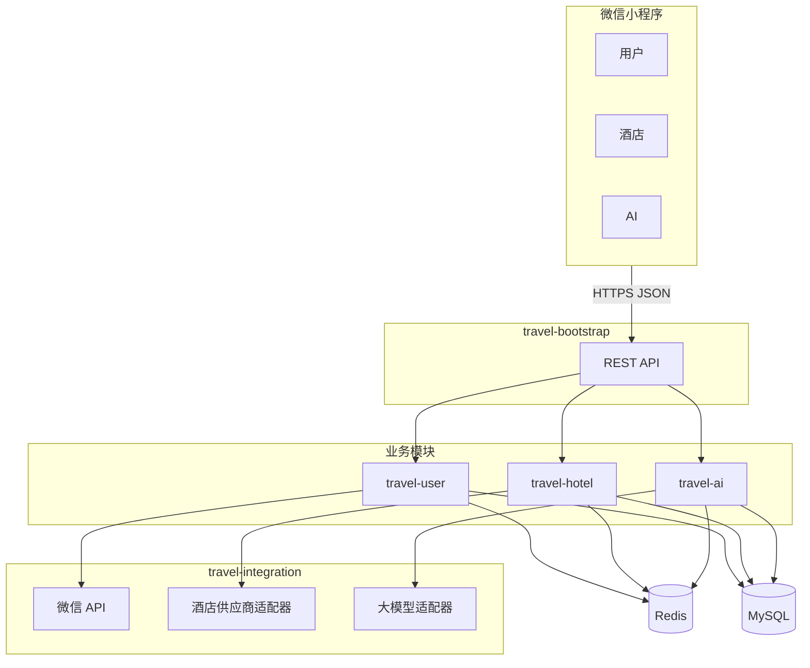

# 微信小程序「智能旅行助手」项目开发方案

本文档在《需求.md》基础上，给出**可落地的技术选型（含选用理由）**、**模块化架构**与**实施路径**，便于后续按模块迭代与扩展。

---

## 一、项目目标与边界

| 维度 | 说明 |
|------|------|
| 产品形态 | 微信原生小程序 + Spring Boot 后端 + MySQL/Redis |
| 核心能力 | 微信登录与用户中心、酒店检索与详情、AI 对话与攻略生成、收藏/历史 |
| 非目标（首期） | 真实酒店下单支付闭环（可作为扩展阶段） |

---

## 二、技术选型与选用理由

### 2.1 小程序端

| 技术 | 版本建议 | 为什么选它 |
|------|-----------|------------|
| **微信原生小程序** | 最新稳定版 | 与微信登录、域名校验、审核规范贴合最好；无额外框架运行时，包体与性能可控。 |
| **Vant Weapp**（可选） | 与基础库兼容的稳定版 | `van-list`、`van-dropdown-menu` 等已在需求中引用，减少自研列表与筛选交互成本。 |

### 2.2 后端核心

| 技术 | 版本建议 | 为什么选它 |
|------|-----------|------------|
| **Java 17 LTS** | 17 | Spring Boot 3.x 基线；长期支持，运维与云厂商镜像成熟。 |
| **Spring Boot** | 3.2.x | 约定优于配置，生态完整；原生支持虚拟线程可选、Observability，适合 REST + 集成第三方 HTTP。 |
| **Spring Web** | 随 Boot | 标准 MVC/REST，与小程序 JSON 交互简单。 |
| **Spring Validation** | 随 Boot | 声明式参数校验，与全局异常处理配合可统一错误码与文案。 |
| **Spring Data Redis** | 随 Boot | Token、会话上下文、酒店短缓存、限流计数器等场景开箱即用。 |

### 2.3 数据持久化

| 技术 | 版本建议 | 为什么选它 |
|------|-----------|------------|
| **MySQL** | 8.0.x | 用户、会话、消息、收藏等结构化关系清晰，事务与索引成熟，运维成本低。 |
| **MyBatis-Plus** 或 **MyBatis + 手写 SQL** | 与 Boot 3 兼容版本 | 复杂查询可控；Plus 可减少样板 CRUD。若团队更偏 JPA，可选 **Spring Data JPA**，但以「SQL 可控 + 报表扩展」为优先时 MyBatis 系更稳。 |
| **Redis** | 7.x | 低延迟；适合 JWT 黑名单/会话、热点酒店缓存、对话短期上下文、分布式限流；减轻 MySQL 与第三方 API 压力。 |

### 2.4 安全与认证

| 技术 | 说明 | 为什么选它 |
|------|------|------------|
| **微信 `jscode2session`** | 官方换 openid | 小程序登录标准路径，避免自研账号体系与微信侧重复造轮子。 |
| **JWT（访问令牌）** | 自签 RS256/HS256（团队规范择一） | 无状态验签，适合小程序每次请求带 `Authorization`；配合 Redis 存过期/登出态可做到可控失效。 |

### 2.5 第三方集成（可插拔）

| 能力 | 技术 | 为什么选它 |
|------|------|------------|
| AI 对话/攻略 | **通义千问 / 文心一言** HTTP API | 国内合规与接入文档相对完善；通过**接口抽象**可在不改动业务层的情况下切换或做多厂商路由。 |
| 酒店数据 | **聚合数据 / 携程开放平台 / 飞猪开放平台** | 以「统一领域模型 + 适配器」接入，首期可只实现一家，后续并行扩展。 |
| HTTP 客户端 | **Spring WebClient** 或 **OpenFeign** | WebClient 适合异步与非阻塞扩展；Feign 适合声明式、快速对接 REST。二选一即可，全项目统一。 |

### 2.6 横切能力

| 技术 | 为什么选它 |
|------|------------|
| **统一异常处理**（`@ControllerAdvice`） | 小程序端只认标准 JSON 错误结构，降低联调成本。 |
| **Redis 限流**（令牌桶/滑动窗口，自研或使用成熟组件） | 保护 AI 与酒店外部 API 额度，防刷。 |
| **日志（Logback + SLF4J）+ 结构化字段** | 线上排障；可后续接阿里云 SLS 等而不改业务代码路径。 |
| **配置外置**（环境变量 / Nacos 可选） | 密钥与 URL 不进仓库；多环境（dev/test/prod）清晰。 |

### 2.7 构建、部署与运维

| 技术 | 为什么选它 |
|------|------------|
| **Maven** 多模块 | 物理隔离模块边界，依赖方向可 enforce，后续拆微服务或独立发布更容易。 |
| **Docker** | 一次构建多处运行；与 ECS 上 CI/CD 配合标准。 |
| **Nginx 反向代理 + HTTPS** | 终止 TLS、静态与网关职责分离；方便限连与缓冲。 |

---

## 三、模块化架构（便于后续加模块）

### 3.1 总体原则

1. **按业务分包/分模块**：用户、酒店、AI、通用组件边界清晰，禁止 Controller 直接调第三方 SDK。  
2. **依赖倒置**：业务层依赖「酒店提供商」「大模型提供商」等**接口**，实现放在 `infrastructure` 或独立 starter。  
3. **统一对外契约**：小程序只消费稳定版本的 API DTO 与错误码，内部换供应商不影响前端。  

### 3.2 推荐 Maven 模块划分

```
travel-assistant (父 POM，统一依赖与插件)
├── travel-common          # 通用：异常码、BaseResult、工具、常量
├── travel-domain          # 领域模型与仓储接口（可选，看团队习惯）
├── travel-user            # 用户：微信登录、JWT、用户资料
├── travel-hotel           # 酒店：查询、详情、缓存、筛选领域服务
├── travel-ai              # AI：会话、消息、Prompt 构建、流式可选
├── travel-integration     # 第三方适配：微信、酒店供应商A/B、通义/文心
└── travel-bootstrap       # 启动模块：装配所有 Bean、OpenAPI、配置
```

- **新增功能时**：优先在对应业务模块增加 `application`（用例）与 `domain`，仅在 `integration` 增加新适配器（如地图、支付）。  
- **travel-bootstrap** 只做**组合根（Composition Root）**，不写业务逻辑，避免循环依赖。

### 3.3 后端分层（单模块内也适用）

```
api（Controller + DTO + 校验）
  → application（用例编排，事务边界）
    → domain（实体、领域服务、领域事件可选）
      → infrastructure（MyBatis Mapper、Redis、第三方 Client 实现）
```

### 3.4 可扩展点（后续加模块的挂钩）

| 扩展点 | 方式 | 示例 |
|--------|------|------|
| 新酒店数据源 | 实现 `HotelSupplier` 接口，Spring 注入列表，路由策略按城市或 AB 测试 | 新增「供应商 C」只加实现类 + 配置 |
| 新大模型 | 实现 `LlmClient` 接口 | 通义/文心/本地模型并行 |
| 新业务能力 | 新 Maven 模块 `travel-itinerary`，依赖 `travel-common` | 行程规划不与酒店强耦合 |
| 限流策略 | 抽象 `RateLimiter` | 按用户、按 IP、按接口维度配置 |

### 3.5 架构关系示意



---

## 四、核心业务流程（与需求对齐）

### 4.1 登录

小程序 `wx.login` → 后端 `jscode2session` → 按 openid 建用户 → 签发 JWT → 会话信息/黑名单写入 Redis（可选）→ 返回 token。

### 4.2 酒店搜索

入参校验 → Redis 缓存 key（目的地+日期+人数+筛选哈希）→ 未命中则调 `HotelSupplier` → 归一化为内部 DTO → 写短 TTL 缓存 → 返回。

### 4.3 AI 对话

鉴权 → 取 `sessionId` 维度的近期上下文（Redis 热数据 + MySQL 持久）→ 组装 system prompt → 调 `LlmClient` → 落库 → 返回；对 AI 接口单独限流。

---

## 五、数据存储要点（概要）

| 数据 | MySQL | Redis |
|------|-------|--------|
| 用户、资料 | 是 | 可选缓存用户信息 |
| 对话会话与消息 | 是 | 近期窗口加速读取 |
| 酒店列表缓存 | 否（或异步落库分析用） | 是，短 TTL |
| Token 失效/限流 | 视设计 | 是 |

具体表结构在详细设计阶段展开（用户表、会话表、消息表、收藏表、审计日志表等）。

---

## 六、API 与协作约定

- **统一响应**：`{ code, message, data }`，业务错误与系统错误码分段。  
- **鉴权头**：`Authorization: Bearer <jwt>`。  
- **幂等**：攻略生成、消息发送等可引入 `Idempotency-Key`（可选，二期）。  
- **版本**：路径前缀 `/api/v1/...`，破坏性变更走 v2。

---

## 七、实施阶段建议

| 阶段 | 内容 | 产出 |
|------|------|------|
| P0 | 父工程 + `bootstrap` + `common`；全局异常、日志、配置模板 | 可启动空壳 + 健康检查 |
| P1 | 用户模块：微信登录 + JWT + Redis | 小程序可登录 |
| P2 | 酒店模块：一供应商适配器 + 缓存 + 列表/详情 API | 列表/详情联调 |
| P3 | AI 模块：会话/消息表 + 一通义或文心适配 + 限流 | 对话与攻略 MVP |
| P4 | 收藏/历史、个人资料编辑 | 工具模块闭环 |
| P5 | Docker、Nginx、HTTPS、小程序域名与提审 | 上线 |

---

## 八、风险与对策

| 风险 | 对策 |
|------|------|
| 第三方酒店 API 变更/限频 | 适配器隔离 + 缓存 + 熔断降级（返回友好提示） |
| 大模型延迟高 | 异步任务（攻略类）+ 前端 loading；可选 SSE/流式 |
| 密钥泄露 | 环境变量、密钥轮转、仓库禁止提交 `.env` |
| 模块边界腐化 | Code review + Maven Enforcer 禁止错误依赖方向 |

---

## 九、小结

本方案以 **Spring Boot 多模块 + 接口化第三方集成 + Redis/MySQL 分工** 落实《需求.md》中的能力，并通过 **`travel-integration` 适配器层** 与 **`HotelSupplier` / `LlmClient` 等扩展点**，保证**新供应商、新 AI、新业务能力**可以低侵入地叠加，符合「模块化、可演进」的目标。
